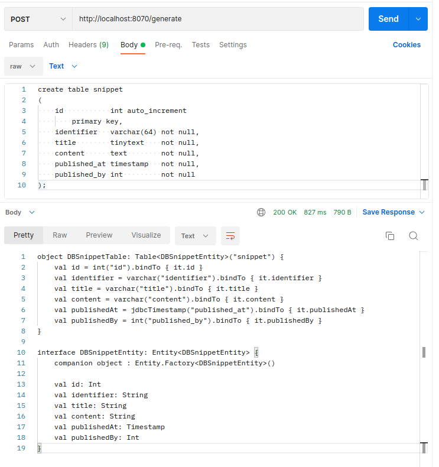

# DDLtoKtorm



Test^^



## Overview

Create Ktorm Table- and Entity boilerplate code from sql ddl.
Public Playground: https://ddltoktorm.maax.gr/

## Supported Dialects

| Dialect  | Status            |
|----------|-------------------|
| MySQL    | Beta              |
| Postgres | Not supported yet |

## Next steps

* [ ] Make MySQL dialect support stable
  * [ ] Support more data types
  * [ ] Add Unit tests
* [ ] Support more dialects

## Manual Generate Request

Send POST Request:

## Contribution

Feel free to submit any issue!

## Setup backend locally

1. Clone project
2. Import gradle project
3. Execute `run`-Task (Gradle menu => `application` => `run`)
